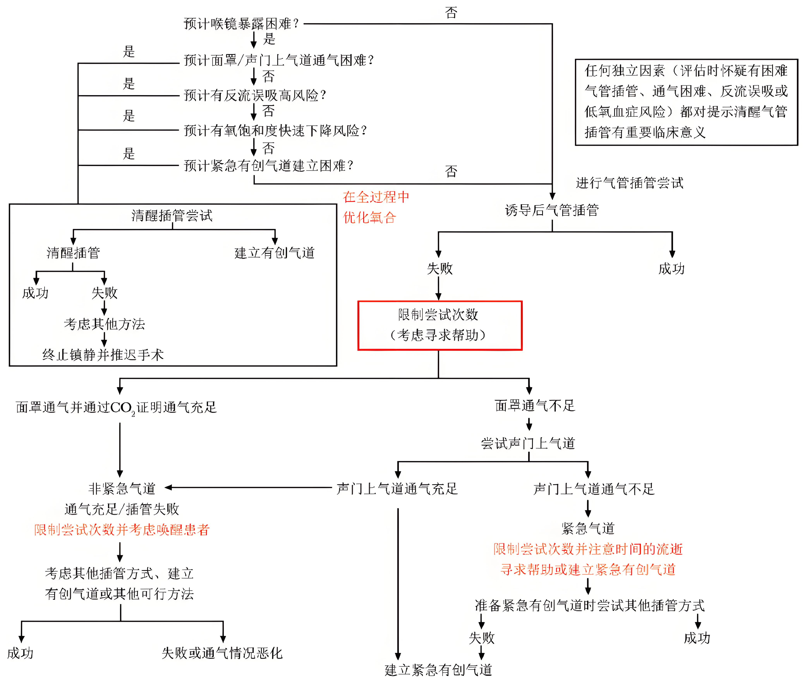

---

title: 麻醉·困难气道  
published: 2026-01-07  
pinned: false  
description: 困难气道不可怕，怕的是没准备——清醒镇静、从容应对，手里有招，心里不慌！。  
tags: [临床麻醉, 困难气道, 气道管理]  
category: 麻醉学习笔记  
licenseName: "CC BY 4.0"  
author: 凉城听暖  
draft: false  
date: 2026-01-07  
image: ./麻醉·困难气道.png  
pubDate: 2026-01-07

---

# 什么是困难气道？
**困难气道**是指：  
> 经过专业训练的、具有5年以上临床麻醉经验的麻醉科医师，发生**面罩通气**困难或**气管插管**困难，或二者**兼具**的临床情况。

该定义强调“有经验者”仍遇困难，排除因操作者经验不足导致的问题，聚焦于患者解剖或病理因素。
 

# 面罩通气困难
### 定义
由于面罩密封不良、气体大量泄漏或通气存在巨大阻力，而使操作者无法给患者提供有效通气（即不能维持足够氧合和通气）。

### 预测指征：  

  

    a. 肥胖
    b. 络腮胡
    c. 下颌短小
    d. 打鼾病史
    e. 阻塞性睡眠呼吸暂停病史
    f. 敏感性皮肤（烧伤、大疱性表皮松解症、新移植皮肤）
    g. 下颌宽大
    h. 下颌肌肉肥厚
    i. 年龄55岁以上
    j. 舌体大
  

  

    k. 寰枕关节伸展差
    l. 咽部病理性改变
    m. 舌扁桃体肥大
    n. 舌扁桃体脓肿
    o. 舌甲状腺
    p. 舌状舌骨囊肿
    q. 面部异常
    r. 面部敷料包裹
    s. 颜面部烧伤
    t. 面部畸形
  

# 困难气管插管
### 定义
无论是否存在气道病理改变，**有经验的**麻醉医师需尝试 **≥3 次**才能完成气管插管，即视为困难插管。

### 预测指征

| **指征** | **提示困难插管的因素** |
| :---: | :---: |
| 既往史 | 困难插管史 |
| 上切牙的长度 | 相对较长 |
| 上下切牙间距 | 小于2指或小于3cm |
| 覆合牙 | 上切牙覆盖下切牙 |
| 颞下关节活动度 | 下切牙不能向前伸展到上切牙前方 |
| 下颌空间 | 小、坚硬、肿物侵入 |
| 颈椎活动范围 | 颏部不能触到胸部或不能伸展颈部 |
| 甲颏距离 | 小于3指（小于6cm） |
| Mallampati/Samsoon分级 | Mallampati/Samsoon分级Ⅳ级，舌体相对较大， 不能看到悬雍垂 |
| 颈部 | 短、粗 |
| 腭部外形 | 高尖形、很狭窄 |
|||
### 常用评估工具

- **Mallampati 分级**：
  - I级：可看到软腭、硬腭、咽峡弓、悬雍垂
  - II级：可看到部分悬雍垂、软腭、硬腭
  - III级：可看到软腭和硬腭
  - IV级：仅能看到硬腭
- **甲颏距离（Thyromental Distance, TMD）**：< 6cm 提示插管困难
- **Wilson 评分**：综合体重、颈椎活动度、下颌活动度、下颌后缩程度、门齿突出程度

## 已预测困难气道的处理策略

### 基本原则
> **最安全策略：在患者清醒状态下、保留自主呼吸的前提下建立人工气道。**

避免在未确保通气安全的情况下诱导全身麻醉。
### 清醒插管技术
1. 气道工具：支气管软镜和视频喉镜。
2. 如何选择：
+ a. 取决于患者因素，操作技能和设备可获得性。
+ b. 张口受限、舌体较大或颈部屈曲畸形固定的患者，支气管软镜可能更合适。
+ c. 气道出血患者，视频软镜可能更适合。
+ d. 已选用的清醒插管技术失败，应考虑替代方法。
+ e. 复杂的临床情况下，可以考虑同时使用视频喉镜和支气管软镜的清醒插管组合方法。
3. 气道表面麻醉效果良好的患者可以通过声门上气道进行纤支镜清醒插管，可能更利于维持气道通畅。
4. 清醒插管流程主要包括：镇静、表面麻醉，纤支镜/视频喉镜插管以及确认导管位置。
5. ⚠️ 若首选清醒插管失败，应立即启动备用方案（如声门上气道、外科气道），**切勿反复盲目尝试**。
6. ✅ **关键点**：良好的表面麻醉可显著提升患者耐受性，减少呛咳与应激反应。

# 如何确认气管插管成功？
1. **直接可视化**：看到气管导管通过声门进入到气管；
2. **纤支镜确认**：
   - 见到气管软骨环（C形结构）
   - 进一步推进可见气管隆突
3.**呼气末二氧化碳（EtCO₂）监测**：可以是定性或者定量，通常可以通过监护仪看到二氧化碳波形及数值；**金标准**：连续3次以上呼吸均有 EtCO₂ 波形。

# 困难插管的患者术后如何拔管？
### 拔管前评估
- 评估**气道水肿风险**：
  - 长时间插管（>6–8 小时）
  - 头颈部手术（尤其涉及舌根、会厌、声门）
  - 术中反复插管尝试
  - 气道创伤或感染
  
> 水肿通常在术后 **24–72 小时达高峰**。  
1. 有水肿风险的患者最好延长气管导管放置时间或采用气管造口术。一旦水肿消除，就可以考虑拔除气管导管或气管套管。
2. 气囊漏气实验可以用来评估气道是否存在水肿，此试验是在拔管前将气管导管套囊放气，可以观察到从气管导管周围溢出气体。临床上若无气囊漏气试验则不能保证安全拔管。

## 附录：困难气道处理流程图

---

> 知识如树，今日播种，坚持浇灌，终成智慧之树。

