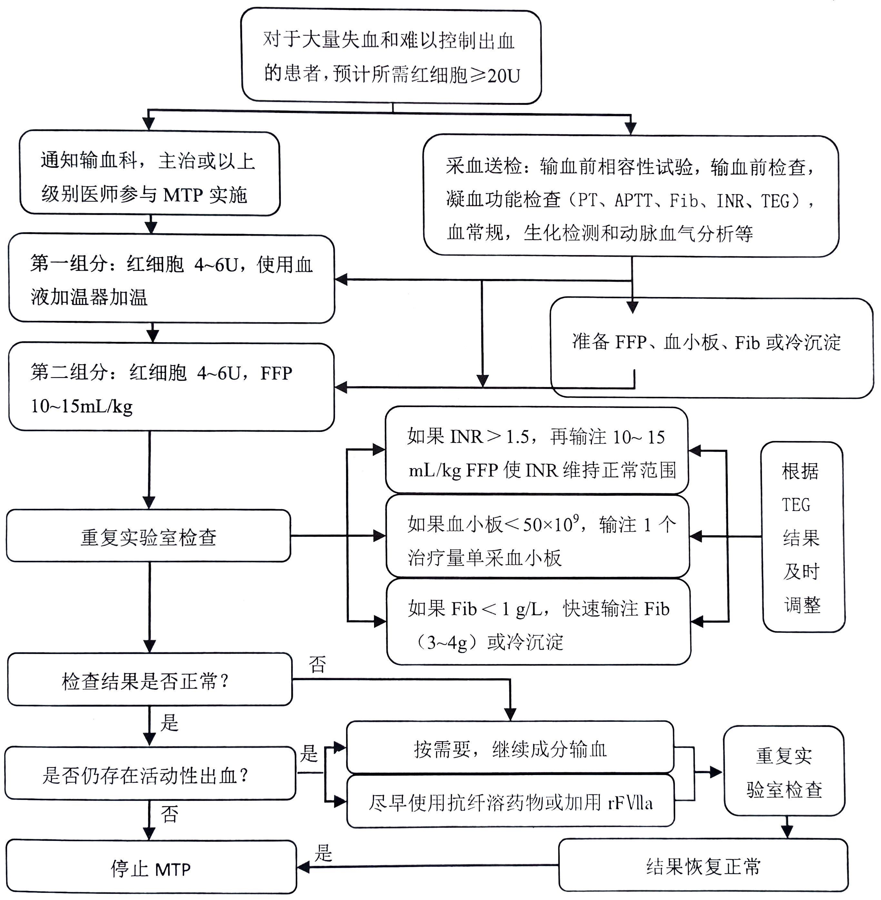

# 定义与标准
## 大量失血
指满足以下任一条件的急性失血：
- **24 小时内丢失 ≥1 倍自身血容量**（约 70 mL/kg）
- **3 小时内失血量 >50% 自身血容量**
- **成人出血速率 ≥150 mL/min**
- **出血速率 ≥1.5 mL/(kg·min) 持续 >20 分钟**

> 📌 **临床实践提示**：  
> - **急性失血**：30 分钟内失血 >50% 血容量  
> - **慢性/隐匿性失血**：累计失血 ≥30% 血容量
> - 特殊情况：如产科大出血、严重外伤、胃肠道大出血等。

## 大量输血
指满足以下任一标准的输血行为：
- **24 小时内输注 ≥10 单位红细胞**（RBC）（部分指南采用 ≥20U，但 ≥10U 已显著增加并发症风险）
- **24 小时内输注血液制品总量 ≥1 倍自身血容量**
- **1 小时内输注 ≥50% 自身血容量**
- **输血速率 >1.5 mL/(kg·min)**

> 临床上患者急性失血量达自身血容量30~50%时，往往需要大量输血

# 失血性休克的病理生理与处理原则
失血性休克的核心是**有效循环血量锐减 → 组织灌注不足 → 细胞缺氧与代谢紊乱**。处理必须遵循：
> **“止血优先，输血为辅”** 的根本原则。

## 关键干预措施：
- **早期确定性止血**：手术、介入栓塞等是提高生存率的关键。
- **控制性低血压**（Permissive Hypotension）：在未控制出血前，维持 **SBP 80–90 mmHg**（或 MAP 50–65 mmHg），避免过度液体复苏加重出血。
- **损伤控制复苏**（Damage Control Resuscitation, DCR）：
  - 限制晶体液（<1.5 L）：避免稀释凝血因子并加重低体温。
  - 早期平衡输血（RBC:FFP:PLT ≈ 1:1:1）
  - 积极纠正低体温、酸中毒、凝血病（“死亡三角”）
  - 补钙：失血休克和输血会导致离子化钙下降，严重时会导致心脏停搏。建议在大量输血后补充钙剂。

# 大量输血方案（Massive Transfusion Protocol, MTP）
为了应对严重创伤合并大出血患者的紧急情况，现代医学通常启动**大量输血方案（MTP）**。MTP是一套标准化的、团队协作的流程，旨在快速、准确地输注合适比例的血液制品，防止“死亡三联征”（低血压、低体温、凝血功能障碍）。
## 核心原则：平衡输血与损伤控制复苏
| 输血比例 | 构成 | 证据等级 |
|----------|------|--------|
| **1:1:1** | 1U RBC : 100mL FFP : 1U 血小板 | **强推荐**（PROPPR 试验） |
| **6:4:1** | 6U RBC : 400mL FFP : 1U 血小板 | 可接受替代方案 |
||||

> 💡 **目标**：预防**稀释性凝血病**，维持凝血因子与血小板功能。

## 启动指征
综合评估以下因素，**无需等待实验室结果**即可启动：

| 类别 | 指标 |
|------|------|
| **生理指标** | 休克指数（HR/SBP）≥1.0；SBP <90 mmHg；心率 >120 bpm；尿量 <0.5 mL/kg/h |
| **实验室指标** | 血乳酸 >4 mmol/L；BE <-6 mmol/L |
| **影像/术中** | FAST 阳性；术中活动性出血（如骨盆骨折、腹腔出血） |
| **评分工具**（辅助） | TASH ≥15；ABC ≥2；RTS ≤10 |
|||
## 执行流程
1. **一键启动 MTP**：通知血库，启动预设血液制品包。
2. **快速输注**：使用加压输液装置、加温输血系统。
3. **动态调整**：根据 TEG/ROTEM、iCa²⁺、Fib 等床旁检测实时调整成分比例。
4. **多学科协作**：麻醉、外科、血库、护理团队无缝衔接。
### 大量输血方案实施流程
 

# 成分输血的循证原则
## 红细胞
- **目标**：维持组织氧供，而非追求“正常” Hb。
- **输注阈值**（复苏后稳定状态）：
  - **一般患者**：Hb <70 g/L
  - **心血管疾病/颅脑损伤**：Hb <100 g/L
  - **术后有症状**（胸痛、体位性低血压）：Hb ≤80 g/L
- **优选**：储存时间 <14 天的 RBC（减少高钾、溶血风险）

## 新鲜冰冻血浆（fresh frozen plasma，FFP）
- **适应证**：
  - PT/APTT >1.5 倍正常值，或 INR >1.5
  - TEG R 值延长
  - **预计需 ≥10U RBC**（应早期经验性输注）
- **剂量**：首剂 **10–15 mL/kg**，后续根据凝血功能调整
- **禁忌**：扩容、纠正低蛋白血症、增强免疫力

## 血小板
- **输注指征**：
  - PLT <50×10⁹/L（大量输血时）
  - PLT 50–100×10⁹/L + 活动性出血
  - **创伤性颅脑损伤/多发伤**：PLT >100×10⁹/L
- **剂量**：**1 个治疗量单采血小板**（≈2U/10kg 浓缩血小板）
- **效果**：1 袋可使 60kg 患者 PLT ↑40×10⁹/L

## 纤维蛋白原（Fib）和冷沉淀
- **指征**：Fib <1.5–2.0 g/L 或 TEG 提示功能性 Fib 缺乏
- **剂量**：
  - **纤维蛋白原浓缩物**：3–4 g IV
  - **冷沉淀**：2–3 U/10kg（1U = 100mL FFP 制备）
- **紧急目标**：Fib ≥1.0 g/L

# 围术期血液保护的方法
为了减少手术中的失血和输血需求，现代医学采用了多种血液保护策略：

| 策略 | 方法 | 适应证 |
|------|------|--------|
| **术前自体储血** | 术前数周采集自体血 | 稀有血型、宗教信仰、既往同种免疫 |
| **急性等容血液稀释**（ANH） | 术前放血 + 胶体/晶体扩容 | Hb ≥110 g/L，无感染/转移瘤 |
| **术中血液回收**（Cell Saver） | 吸引、抗凝、洗涤、回输 | 预计失血 >500 mL 的清洁手术 |
| **药物** | TXA（1g IV）、抑肽酶、促凝药 | 创伤、心脏、脊柱手术 |
||||

> ⚠️ **血液回收禁忌**：污染（肠液、羊水）、恶性肿瘤、溶血超 6 小时。

# 全程监测与复苏目标
大量输血过程中，应执行“闭环式”管理，持续监测并调整方案。复苏终点目标参考如下：

| 指标 | 目标值 |
|------|--------|
| **体温** | ≥36.0°C |
| **pH** | 7.35–7.45 |
| **血乳酸** | <2.0 mmol/L（且呈下降趋势） |
| **离子钙**（iCa²⁺） | >1.1 mmol/L |
| **血小板** | >50×10⁹/L（中枢神经损伤 >100×10⁹/L） |
| **纤维蛋白原** | 1.5–2.0 g/L |
| **ScvO₂** | >70% |
|  |  |

> ✅ **复苏成功标志**：不仅生命体征恢复，更需**内环境稳态重建**。

# 结语：从“被动补血”到“主动止血”
大量失血与大量输血是围术期最严峻的挑战之一。  
现代救治已从“被动补血”转向“主动止血 + 损伤控制复苏”的整合模式。

> **快速识别、果断止血、精准输血、全程监测**，是打破“死亡三角”、改善预后的四大支柱。  
> 麻醉医师作为围术期生命守护者，必须精通 MTP 流程，成为多学科团队中的关键决策者。
---
> 学海无涯勤作舟，点滴积累铸就智慧高峰。