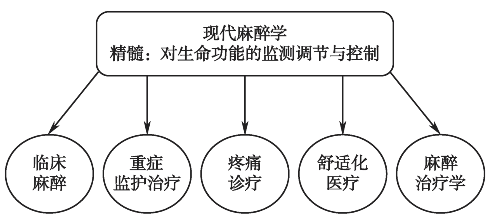

---

title: 麻醉·序言  
published: 2026-01-06  
pinned: false  
description: 麻醉学笔记&序言。  
tags: [临床麻醉]  
category: 麻醉学习笔记  
licenseName: "CC BY 4.0"  
author: 凉城听暖  
draft: false  
date: 2026-01-06  
image: ./麻醉·序言.webp  
pubDate: 2026-01-06

---

# 今日之麻醉
1846年，乙醚麻醉的首次公开演示获得成功，揭开了近代麻醉学的序幕，迄今已有180年的历史。经过一代又一代麻醉人的探索及历史的沉积，麻醉学在其自身发展过程中，汲取并集中了基础医学、临床医学、生物医学工程以及多种边缘学科中有关麻醉学的基本理论和工程技术，形成了麻醉学自身的理论与技术体系。  

时至今日，麻醉的**内涵**已不仅仅只是传统的镇痛、镇静、肌松三要素，而是在此基础上进行了深度和广度上的拓展，麻醉**核心技术**也已逐步提升为对患者生命状况的及时判断与对机体生理功能的有效调控。现代麻醉学已发展成为一门研究临床麻醉、生命功能调控、重症监护治疗、疼痛诊疗、舒适化医疗及麻醉治疗的科学，是临床医学中重要的二级学科，其基本理论与技能是临床医师必须掌握、熟悉与了解的。  

# 麻醉学之核心竞争力
就竞争的本质而言，一个学科的存在与发展取决于学科整体，尤其是**人才**与**技术**的不可取代性。麻醉学经过180年的沉积已初步具备这一特质，但仍然不够强大。面对未来，面对医学科学的迅猛发展，麻醉学如果要继续做大做强，就必须坚持在临床（手术）麻醉的基础上继续拓展工作领域、强化科技创新、构建高技术平台、培育卓越创新人才，在生命功能调控、重症监护治疗、疼痛诊疗、舒适化医疗及麻醉治疗等方面有所作为。为此，医院麻醉科室的运行必须要贯彻落实以医疗为基础、以科研为先导、以教育为根本的指导思想，要努力克服被动局面，形成医、教、研相辅相成、良性循环的新发展格局。

# 现代麻醉学
现今麻醉医师的**任务**已不仅仅是为手术顺利进行提供镇静、无痛、肌松及合理控制应激等必需条件，还要对患者生命功能进行监测、调节与控制，维护重要器官功能，提高危重患者医疗救治质量，并在确保患者术后快速顺利康复方面起支撑作用。如今，麻醉的工作已从手术室内拓展到手术室外：临床麻醉的时间跨度也从术中延伸到术前与术后；其内涵包括一切与患者安全、生存质量有关的领域；不仅要求有专业技术，更要有系统的专业理论。目前疼痛学与重症医学虽然已发展成为新的独立专业，但与麻醉学的关系源远流长、难以分割，疼痛与重症治疗仍然是麻醉学的重要组成部分。

---
> 学习是漫长旅程，每小步都是向未来的坚实脚印。
