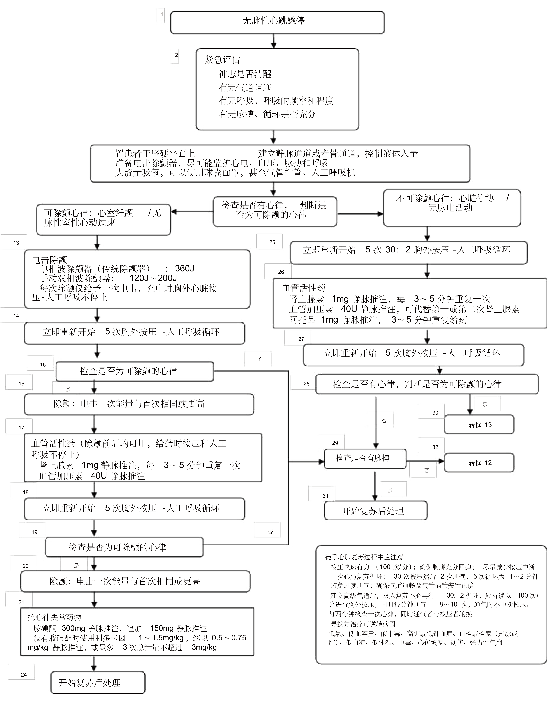
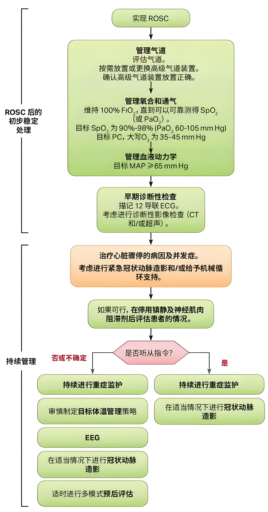
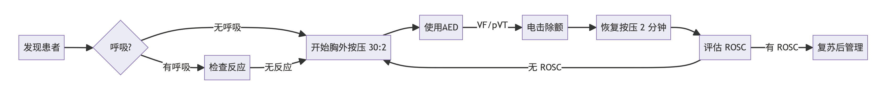

# 无脉性心搏骤停
**无脉性心搏骤停**（Pulseless Cardiac Arrest, PCA）是指患者突发意识丧失、无有效自主呼吸、大动脉搏动消失，且心电图表现为以下四类心律之一：
- **可电击心律**：室颤（VF）、无脉性室速（pVT）
- **不可电击心律**：无脉性电活动（PEA）、心脏停搏（Asystole）

> 📌 **核心原则**：抢救成功高度依赖**高质量心肺复苏**（CPR）与**快速识别并逆转可逆病因**。

# 生存链：六大环节

1. **立即识别与启动应急反应系统**  
2. **尽早实施高质量CPR**  
3. **快速除颤**（可电击心律）  
4. **高级生命支持**（ACLS）  
5. **心脏骤停后综合管理**
6. **康复**

> ⚠️ **时间窗效应**：每一环节延迟1分钟，存活率下降7–10%；从倒地到首次除颤每延迟1分钟，VF患者存活率下降7–10%。

# 初始评估与识别：快、准、稳
- **确认现场安全**：确保自身和患者所处环境安全，避免二次伤害。
- **判断意识**：轻拍并呼喊患者，判断是否有反应。
- **检查呼吸与脉搏**（同时进行，≤10秒）：
  - **无正常呼吸**（仅有濒死喘息视为无效呼吸）；
  - **颈动脉搏动消失**（非专业人员可跳过脉搏检查，直接开始CPR）。
- **立即呼救**：寻求周围人员协助，启动急救系统（如拨打120）、获取AED/除颤仪。

> ⚠️**注意**：切勿因反复确认脉搏延误CPR！对无反应、无正常呼吸者，**默认为心搏骤停**，立即开始胸外按压。

# 基础生命支持（BLS）：高质量CPR是基石

## CPR操作要点（C-A-B顺序）：

| 要素 | 标准 |
|------|------|
| **按压位置** | 胸骨下半段（两乳头连线中点） |
| **按压深度** | 5–6 cm（成人） |
| **按压速率** | 100–120 次/分钟 |
| **胸廓回弹** | 完全回弹，手不倚靠胸壁 |
| **中断时间** | ≤10秒（如换人、除颤、插管） |
| **按压-通气比** | 30:2（单人或未建立高级气道）；持续按压+每6秒1次通气（已建立高级气道） |
|||

## 通气要求：
- 使用球囊面罩（BMV）时，每次通气**1秒**，见胸廓抬起即可，避免过度通气（增加胸腔内压，减少静脉回流）。
- **优先保证按压质量**，通气可在按压间隙进行。

## AED使用：
AED 到达后，按语音提示操作，分析患者心律是否为 “可电击心律（shockable rhythm）”：
- **可电击**心律：给予 1 次电击，然后**立即恢复 CPR 2 分钟**，之后再次由 AED 分析心律，重复此过程，直到专业高级生命支持（ALS）人员接管或患者开始活动。
- **不可电击**心律：**立即恢复 CPR 2 分钟**，之后由 AED 分析心律，持续操作直到专业人员接管或患者开始活动。

> **贴电极片时不停止按压**，分析心律时暂停按压

## 成人无脉性心搏骤停抢救流程

# 高级生命支持（ACLS）

## 心律分类与处理路径

### 可电击心律:VF/pVT
1. **立即除颤**
  - 双向波120–200 J
  - 单向波360 J
2. **除颤后立即恢复CPR**2分钟，**禁止立即检查心律或脉搏**！；
3. **2分钟后检查心律**：
   - 仍为VF/pVT → 第二次除颤（能量同前或递增）；
   - 转为不可电击心律 → 进入PEA/Asystole流程；
4. **药物干预**（在CPR期间给予）：
   - **肾上腺素 1 mg IV/IO**：首次给药在**第2次除颤后**，之后每3–5分钟重复；
   - **胺碘酮 300 mg IV/IO**：第3次除颤前给予（若仍为VF/pVT）；可追加150 mg；
   - **利多卡因**（替代选择）：1–1.5 mg/kg，后续0.5–0.75 mg/kg，最大3 mg/kg。

> **关键**：除颤后**不要**立即检查心律或脉搏！必须完成2分钟高质量CPR后再评估。

### 不可电击心律：PEA/Asystole
1. **立即开始高质量CPR**（2分钟）；
2. **建立高级气道**（如气管插管、声门上装置），确认位置（呼气末CO₂监测）；
3. **肾上腺素 1 mg IV/IO**：每3–5分钟重复；
4. **每2分钟轮换按压者**，避免疲劳导致按压质量下降；
5. **重点：寻找并逆转可逆病因**（Hs and Ts）

## 可逆病因识别与干预
### “Hs and Ts”——抢救成败的关键

所有无脉性心搏骤停均需同步排查以下可逆病因：
| **Hs** | **Ts** |
|--------|--------|
| **Hypovolemia**（低血容量） | **Toxins**（中毒） |
| **Hypoxia**（缺氧） | **Tamponade**（心包填塞） |
| **Hydrogen ion**（酸中毒） | **Tension pneumothorax**（张力性气胸） |
| **Hyper-/Hypokalemia**（高/低钾） | **Thrombosis**（肺栓塞/冠脉栓塞） |
| **Hypothermia**（低体温） | **Trauma**（创伤性出血） |
|||

### 针对性干预
- **张力性气胸**：立即于锁骨中线第二肋间穿刺减压；
- **心包填塞**：床旁超声确诊后行心包穿刺；
- **肺栓塞**：考虑溶栓（如rt-PA 50 mg IV）；
- **高钾血症**：10% 葡萄糖酸钙1g IV、胰岛素+葡萄糖、沙丁胺醇；
- **低体温**（<30℃）：持续CPR，复温至>30℃再考虑终止抢救。

> 💡 **ACLS 本质是“边复苏边诊断”的过程**，而非机械执行流程。

## 高级气道管理
- 一旦建立气管插管，**持续胸外按压**，通气频率**10次/分钟**；
- 使用**呼气末二氧化碳**（EtCO₂）监测：
  - EtCO₂ <10 mmHg 提示CPR质量差或无 ROSC；
  - EtCO₂ 突然升高至30–40 mmHg 可能提示自主循环恢复（ROSC）。

## 血管通路
- 首选**外周大静脉**（肘正中、颈外静脉）；
- 次选**骨髓腔通路**（胫骨近端、肱骨头）；

> ⚠️**避免中心静脉穿刺延误CPR**。

# 终止复苏的指征
- 满足以下条件可考虑终止：
  - 经充分ACLS（≥20分钟）无 ROSC；
  - 初始心律为 Asystole 且无可逆病因；
  - EtCO₂ 持续 <10 mmHg；
  - 明确 DNR（不复苏）医嘱。
- **例外**：低温、药物过量、溺水等特殊病因，应**延长抢救时间**。

# 自主循环恢复（ROSC）后的管理
抢救成功仅是第一步，**骤停后综合征**决定最终预后：

1. **优化通气与氧合**：  
   - SpO₂维持90–98%，避免高氧（PaO₂>300 mmHg）；
   - PaCO₂维持正常（35–45 mmHg）。

2. **血流动力学支持**：  
   - MAP ≥65 mmHg（去甲肾上腺素首选）；
   - 目标导向液体管理，避免容量过负荷。

3. **目标体温管理**（TTM）：  
   - 对昏迷患者，维持在**32–37.5℃**24小时，避免高热，以保护脑组织；
   - 缓慢复温（0.25–0.5℃/h），预防寒战与电解质紊乱。

4. **病因治疗与PCI**：  
   - 怀疑心源性骤停 → **紧急冠脉造影**（无论是否 STEMI）；
   - 头颅CT排除脑出血。

5. **多学科协作**：ICU、心内科、神经科共同制定**神经功能预后评估计划**（72小时后结合EEG、NSE、S100B等）。

6. **个体化复苏后管理**：精准的血压管理、早期神经预后评估等。

## 自主循环恢复后救治流程

# 抢救流程图示（简化版）

## 结语：以高质量复苏为舟，以可逆病因为舵，驶向生之彼岸
成人无脉性心搏骤停的抢救是一场与时间赛跑的系统工程。  
**高质量 CPR 是贯穿始终的生命线，快速除颤是可电击心律的“特效药”，而识别并逆转可逆病因则是打开生之门的钥匙**。

麻醉医师作为 ACLS 核心成员，必须熟练掌握标准化流程，同时保持临床思辨能力，在规范中寻求个体化突破。

> **在心搏骤停面前，行动胜于犹豫，协作优于孤勇，细节决定生死**。
---
> 书山有路勤为径，学无止境方能行稳致远。